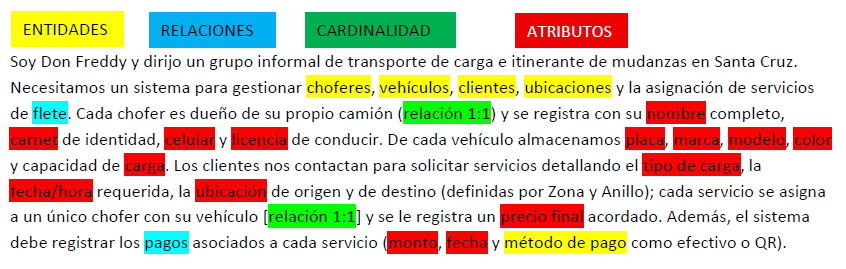

UNIT 1 - SPANISH INTERVIEW AND UML DIAGRAM FOR THE STARTING OF PROJECT
==============================================

# Proyecto de Curso: Sistema de Gestión de Fletes y Mudanzas "Los Camioncitos"

Este proyecto surge como caso de estudio para la materia **Bases de Datos 1** de la carrera de **Ingeniería Informática** en la **Universidad Autónoma Gabriel René Moreno (UAGRM)**. El objetivo principal es realizar el diseño conceptual, lógico y físico de una base de datos que resuelva los problemas logísticos, de tarificación y de registro de una asociación informal de transportistas en Santa Cruz de la Sierra.

## 📋 Transcripción de la Entrevista de Levantamiento de Requerimientos

*   **Entrevistador:** Estudiante de Ingeniería Informática (UAGRM)
*   **Entrevistado:** Don Freddy (Líder del grupo de transportistas)

---

## Transporte de Carga — "Camioncitos de Don Freddy"

**Narración del cliente:**  
> "Soy Don Freddy y dirijo un grupo informal de transporte de carga e itinerante de mudanzas en Santa Cruz. Necesitamos un sistema para gestionar choferes, vehículos, clientes, ubicaciones y la asignación de servicios de flete. Cada chofer es dueño de su propio camión (relación 1:1) y se registra con su nombre completo, carnet de identidad, celular y licencia de conducir. De cada vehículo almacenamos placa, marca, modelo, color y capacidad de carga. Los clientes nos contactan para solicitar servicios detallando el tipo de carga, la fecha/hora requerida, la ubicación de origen y de destino (definidas por Zona y Anillo); cada servicio se asigna a un único chofer con su vehículo y se le registra un precio final acordado. Además, el sistema debe registrar los pagos asociados a cada servicio (monto, fecha y método de pago como efectivo o QR)."

**Suposiciones:**

* Se identifica al cliente de manera única mediante su número de teléfono o documento de identidad.
* Un cliente puede registrar múltiples solicitudes de servicio a lo largo del tiempo, pero cada servicio específico es atendido por un único chofer y un único camión. Si una carga requiere dos camiones, se registran dos servicios independientes.
* Un viaje o servicio tiene exactamente una ubicación de origen y una de destino, las cuales se estructuran en base a catálogos de Zonas y Anillos para el cálculo y estandarización de la tarifa base.

---

## 📐 Diseño Conceptual (UML)

A continuación se presenta el diagrama de clases generado en **StarUML** que modela los requerimientos descritos en la entrevista:

