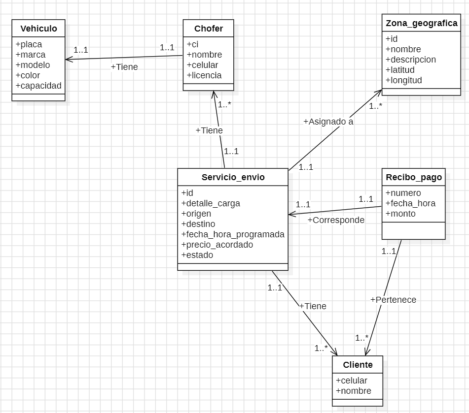

UNIT 1 - SPANISH INTERVIEW AND UML DIAGRAM FOR THE STARTING OF PROJECT
==============================================

# Proyecto de Curso: Sistema de Gestión de Fletes y Mudanzas "Los Camioncitos"

Este proyecto surge como caso de estudio para la materia **Bases de Datos 1** de la carrera de **Ingeniería Informática** en la **Universidad Autónoma Gabriel René Moreno (UAGRM)**. El objetivo principal es realizar el diseño conceptual, lógico y físico de una base de datos que resuelva los problemas logísticos, de tarificación y de registro de una asociación informal de transportistas en Santa Cruz de la Sierra.

## 📋 Transcripción de la Entrevista de Levantamiento de Requerimientos

*   **Entrevistador:** Estudiante de Ingeniería Informática (UAGRM)
*   **Entrevistado:** Don Freddy (Líder del grupo de transportistas)

---

**Entrevistador:** Don Freddy, cuénteme un poco... ¿cómo fue que se animó a armar este negocio de los camioncitos aquí en Santa Cruz?

**Freddy:** Mire, esto empezó de la nada, de a poquito. Yo me ganaba la vida con un camión chico, de esos antiguos, y paraba viendo que la gente siempre andaba buscando quién le lleve unas cuantas bolsas de cemento, maderas, cosas de construcción, ¿no ve? Entonces, pucha, junté unos pesos, me arriesgué a comprar otro y de ahí ya se fueron sumando unos amigos con sus movilidades. Así, charlando, nació la empresita.

**Entrevistador:** Qué bueno. ¿Y con cuántos camiones cuentan ahorita?

**Freddy:** Ahorita estamos con cuatro, a veces cinco camioncitos dando vueltas. Todos chicos sí, nada de esos Condor grandotes que trancan las calles. Y mire, la cosa es bien abierta: si aparece otro chofer que conocemos y quiere meterle, lo metemos al grupo. Es casi como una cooperativa, pero informal... todo por WhatsApp nomás, directo.

**Entrevistador:** Ahh, ¿todo por WhatsApp? ¿Cómo le hace la gente para pillarlos entonces?

**Freddy:** Facilito. El cliente nos tira un mensaje, nos dice: *"Oye, necesito llevar unos muebles del Plan Tres Mil al norte, a tal lado"*. Ahí yo lo lanzo al grupo del WhatsApp y vemos quién está libre o quién anda cerca por la zona para agarrar el viaje. El que está más a tiro, se lo lleva.

**Entrevistador:** O sea que hacen de todo... mudanzas, materiales...

**Freddy:** De todo un poco, la verdad. Pero lo que más se mueve es cemento, fierros, madera para las obras... y claro, las típicas mudanzas chicas.

**Entrevistador:** Me imagino. Pero a ver, organizarse solo con WhatsApp debe tener sus contras. ¿Qué es lo que más les dificulta en el día a día?

**Freddy:** Los precios. Como no tenemos una oficina fija, a veces los choferes no se ubican bien con las distancias de los barrios nuevos. Entonces tiran un precio al azar, medio al ojo. Al rato el cliente llama confundido porque un chofer le cobró 150 y el otro, por lo mismo, le quería sacar 220. Eso nos hace quedar mal, nos tumba la confianza.

**Entrevistador:** Claro, la gente siente que le están adivinando el precio. ¿No han pensado en armar, no sé, una tablita de Excel o una base de datos para controlar eso?

**Freddy:** Sí, pucha, sería bueno. Si tuviéramos un sistema o algo en el celular que vos le metas la distancia, la ruta, y qué tipo de carga es, y te bote la tarifa justa... Sería más transparente.

**Entrevistador:** ¿Y por qué no se meten a Yango Cargo o a Uber? Ellos ya hacen eso.

**Freddy:** Ya, pero mire... esas apps son más que todo para autos, y cuando queres carga, los precios son carísimos. Aparte, usted sabe cómo es Santa Cruz, hay barrios alejados donde los mapas de esas apps ni entran o los choferes no quieren ir. Nosotros nos metemos a donde sea, negociamos directo con el cliente, somos más flexibles, más rápidos. Es otra cosa.

**Entrevistador:** Claro, conocen y saben a dónde ir. ¿Y dónde paran mientras esperan que caiga un pedido? ¿Tienen un punto fijo?

**Freddy:** Sí, nos paramos donde hay mas movimiento. Nos vas a pillar siempre ahí por el 6to anillo y la Santos Dumont, ahí se concentran varios camiones. Ponemos los camiones en fila y a esperar que suene el celular. Entra el mensaje, miramos el mapa y listo, arrancamos. O muchos vienen en persona.

**Entrevistador:** Increíble que todo el negocio dependa de una sola app. Si se cae WhatsApp, se quedan sin varios pedidos ese día.

**Freddy:** Es la verdad. Sin WhatsApp nos afecta, no se trabaja mucho. Ahí entra el pedido, por ahí el cliente nos pasa su ubicación en tiempo real, nos mandan fotos de lo que van a cargar para ver si va a entrar en el camión... todo se mueve por ahí, mayormente.

**Entrevistador:** Me decía que el tema de los precios les genera desconfianza. ¿Qué otra cosa nota que al cliente le da desconfianza?

**Freddy:** Y... el miedo a que no llegues, o que le dejes la carga plantada. Como no hay una oficina donde ir a quejarse si pasa algo, la gente desconfía. Por eso nosotros nos rajamos por ser puntuales y bien transparentes, pero sé que nos falta ese toque de seriedad, algo más formal, ¿no?

**Entrevistador:** ¿Y se animaría a tener una aplicación propia del negocio? Así como un "Uber de camioncitos" de ustedes.

**Freddy:** Sería una belleza, lo ideal, pero es carísimo. Si saliera alguien que nos dé una mano para armar algo sencillo, que maneje las rutas y las tarifas pero sin tanta vuelta, seria bueno.

**Entrevistador:** ¿Y el tema de la plata? ¿Puro efectivo o ya entró el QR a los camiones?

**Freddy:** El QR ya está salvando harto, sobre todo la gente joven te pide al toque. Pero la verdad es que el efectivo manda todavía. Cuando dejas las cosas en el lugar, recién te pagan el contadito.

**Entrevistador:** Me interesaría ayudarle con ese sistema de precios y rutas para su empresa. Pero para armar algo que les sirva bien, necesito entender al detalle cómo se organizan internamente. Por ejemplo, me dijo que son como cuatro o cinco choferes... ¿Cada chofer tiene su propio camión o se los turnan?

**Freddy:** No, aquí cada quien es dueño de su herramienta de trabajo. Cada chofer tiene su camioncito propio. Eso sí, para registrarlos bien en nuestro grupo, yo les pido siempre su nombre completo, su carnet de identidad, su número de celular y su licencia de conducir, para saber que todo es legal, ¿no ve?

**Entrevistador:** Ya, perfecto. ¿Y del camioncito qué datos anotas?

**Freddy:** De la movilidad anoto la placa, el modelo, la marca y el color, asi el cliente lo reconoce cuando llegue. Y otra cosa importante es la capacidad de carga, para saber a cual camion le asignamos.

**Entrevistador:** Claro, tiene sentido. Mencionó que cuando entra un pedido, usted lo pasa al grupo de WhatsApp. ¿Cómo es el proceso exacto desde que el cliente le escribe? ¿Qué le pregunta primero?

**Freddy:** Mire, cuando el cliente me timbra o me escribe, lo primero es registrar quién es. Le pido su nombre y su teléfono. De ahí le pregunto: *"¿Qué va a llevar y de dónde a dónde?"*. Asi ya se que carga es, y desde donde y hasta donde va a querer.

**Entrevistador:** ¿Y cómo manejan el tema de la fecha y hora? ¿Todo es para el momento?

**Freddy:** No siempre. A veces reservan para otro dia. Así que yo anoto la fecha y hora en la que el cliente quiere el servicio. Y cuando ya coordinamos con el chofer que va a ir, lo anotamos para no olvidar. Tambien el precio final que cerramos con el cliente.

**Entrevistador:** Muy bien. O sea que un servicio lo toma un único chofer con su camión. ¿O puede ir más de un camión al mismo servicio?

**Freddy:** No, cada flete es para un solo chofer con su camión. Si el cliente tiene una carga tan grande que necesita dos camiones, nosotros lo manejamos como dos pedidos separados, dos servicios distintos con dos choferes diferentes. Así no nos chipamos con las cuentas.

**Entrevistador:** ¿Y cómo hacen con las ubicaciones de la ciudad? ¿Les tarifan por anillo, por zona o cómo?

**Freddy:** Lo dividimos la ciudad por Zonas y Anillos. Por ejemplo: Zona Norte, Zona Sur, Plan Tres Mil, Pampa de la Isla, Equipetrol... y los anillos del 1ro al 8vo. Lo ideal sería tener tarifa base cobrar, y a eso solo le sumemos un extra si la carga es muy pesada o si hay que pagar peaje o pasar un bloqueo.

**Entrevistador:** Y una ultima pregunta sobre los pagos. Cuando el cliente paga, ¿ustedes le dan algún tipo de recibo o comprobante?

**Freddy:** Por el momento no damos nada, todo es de palabra. Pero hay clientes que necesitan recibo, o hasta factura nos preguntan.

---

## 📐 Diseño Conceptual (UML)

A continuación se presenta el diagrama de clases generado en **StarUML** que modela los requerimientos descritos en la entrevista:

