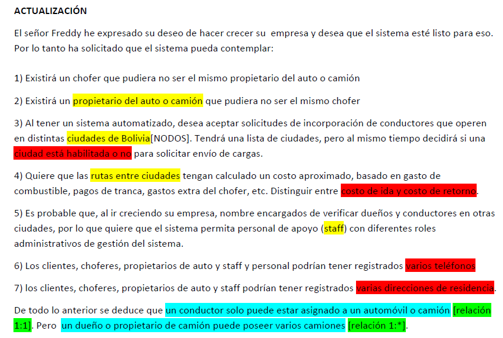
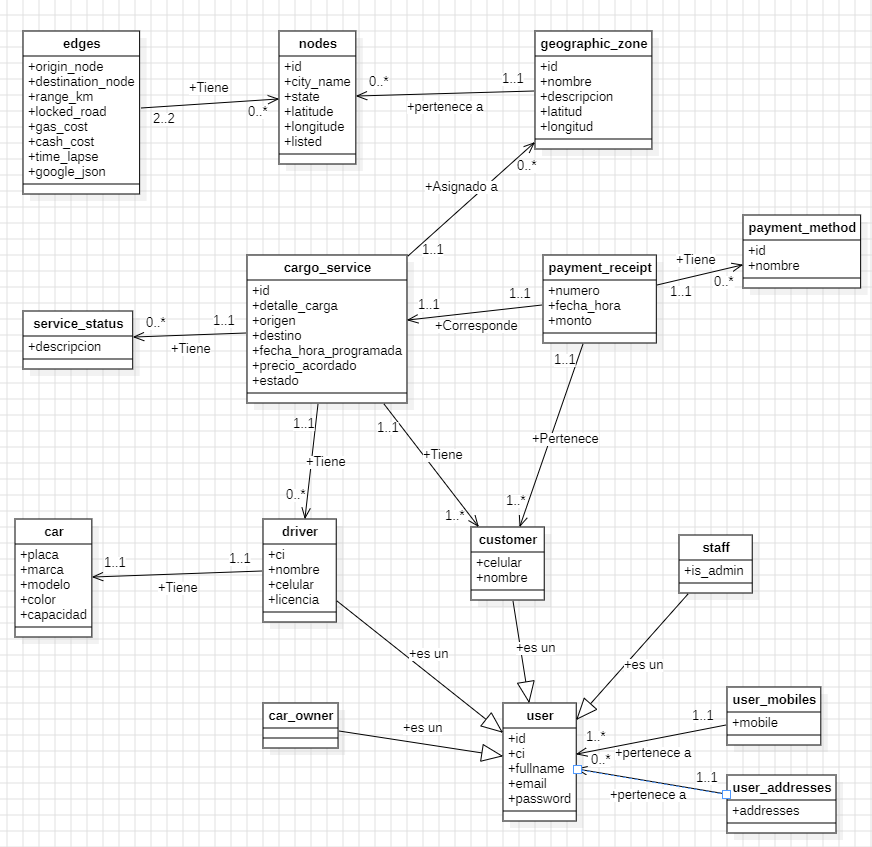
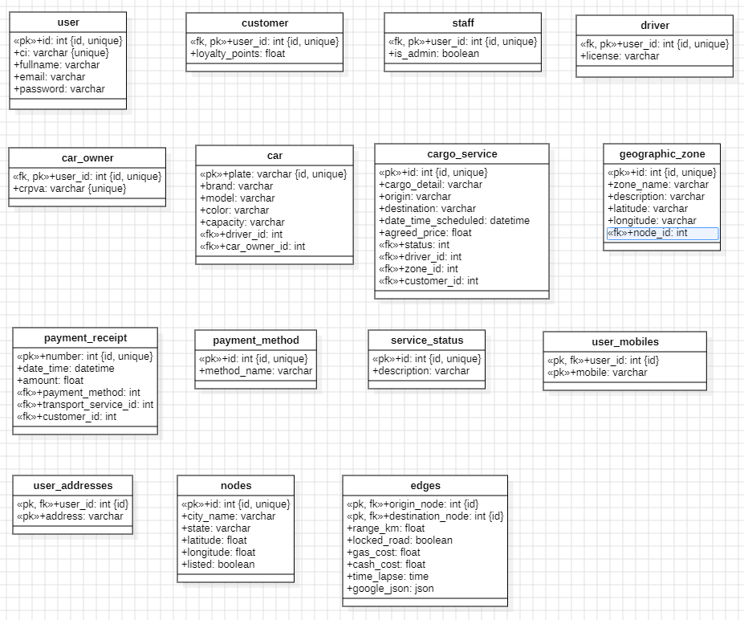

# Actualización del diseño de la base de datos y normalización

A solicitud del señor Freddy, se ampliaron los requisitos del sistema para que la base de datos contemple el crecimiento de la empresa y la operación del servicio de transporte de carga en distintas ciudades. La actualización funcional se resume en la primera imagen:

## Cambios reflejados en el diseño conceptual

El nuevo diseño conceptual incorpora las necesidades solicitadas y diferencia conceptos que antes podían confundirse:

- **Usuario y perfiles:** `user` concentra los datos comunes de identificación y acceso. `driver`, `car_owner`, `customer` y `staff` representan perfiles especializados vinculados al usuario. Así, ser conductor no implica necesariamente ser propietario del vehículo; además, un propietario puede asociarse con varios vehículos.
- **Vehículos y conductores:** `car` representa los automóviles o camiones, mientras que las relaciones con conductor y propietario se modelan por separado, de acuerdo con las cardinalidades planteadas.
- **Ciudades, zonas y rutas:** `nodes` registra las ciudades y permite indicar si están habilitadas para recibir solicitudes. `geographic_zone` organiza zonas geográficas asociadas a nodos, y `edges` representa las rutas entre ciudades, con datos como distancia, estado de la vía, costos y duración estimada.
- **Servicios y estados:** `cargo_service` registra cada solicitud de transporte y se relaciona con el cliente, el conductor, la zona correspondiente y un estado. Los vehículos se vinculan por separado con el conductor y el propietario. Los estados se mantienen en `service_status`, en lugar de repetir su descripción en cada servicio.
- **Pagos:** `payment_receipt` registra los pagos asociados al cliente y al servicio, y `payment_method` mantiene por separado el catálogo de métodos de pago.
- **Datos de contacto:** se contemplan varios teléfonos y varias direcciones por usuario.
- **Personal de apoyo:** `staff` permite representar al personal administrativo como un perfil de usuario.

El resultado conceptual actualizado se muestra a continuación:

## Aplicación de la normalización en el diseño lógico

La normalización guía la organización de estos datos para reducir duplicaciones y evitar anomalías al insertar, actualizar o eliminar información:

1. **Primera forma normal (1FN):** cada atributo almacena un valor individual. Como un usuario puede registrar varios teléfonos y domicilios, estos datos se trasladan a `user_mobiles` y `user_addresses`, en vez de guardarse como listas o valores repetidos en una columna de `user`.
2. **Segunda forma normal (2FN):** en las tablas con claves compuestas, los atributos no clave dependen de la clave completa, no solo de una parte. En `edges`, por ejemplo, los datos de una ruta se asocian con el par formado por el nodo de origen y el nodo de destino. En `user_mobiles` y `user_addresses`, la clave compuesta identifica cada teléfono o dirección en el contexto del usuario al que pertenece.
3. **Tercera forma normal (3FN):** se separan datos que describen entidades o catálogos independientes. Los datos comunes del usuario no se repiten en las tablas de cada perfil; los estados y métodos de pago se referencian mediante sus propias tablas; y ciudades, zonas, rutas, vehículos, servicios y comprobantes se representan como entidades relacionadas mediante claves.

Con esta descomposición, los cambios en un estado, método de pago, ciudad o usuario se realizan en un único lugar, y las relaciones entre entidades se expresan mediante claves primarias y foráneas. Esto facilita mantener la consistencia de la información a medida que se agregan conductores, propietarios, clientes, personal, ciudades y servicios.

El diseño lógico actualizado, donde se detallan tablas, atributos, claves y referencias, es el siguiente:

